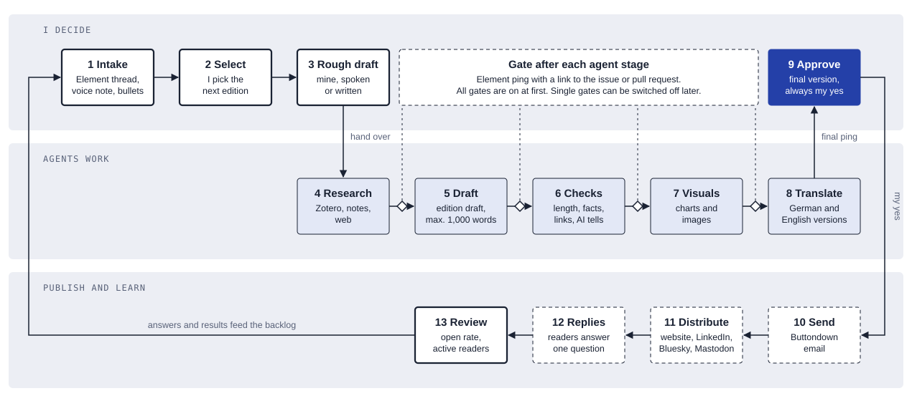

# Pipeline map

Draft 1 of 2026-10-01. One edition, from idea to reader.

Ideas and rough drafts stay mine. Agents take over from research to translation and ask me after each stage. Nothing goes out without my yes. Thick outline: me. Tinted: agents. Dashed: tools and readers outside the repository. Diamond: gate.

The edition template is in [template.md](template.md).

## Stages

| # | Stage | Who | Status |
|---|---|---|---|
| 1 | Intake: ideas from an Element thread, voice notes, bullets | Me | open |
| 2 | Select the next edition from the backlog | Me | open |
| 3 | Rough draft, spoken or written | Me | open |
| 4 | Research: Zotero, my notes, the web | Agent | open |
| 5 | Draft the edition, 1,000 words or fewer | Agent | open |
| 6 | Checks: length, facts, links, AI tells | Agent | open |
| 7 | Visuals: charts and images | Agent with me | open |
| 8 | Translate: German and English | Agent | open |
| 9 | Approve the final version | Me | open |
| 10 | Send by email (Buttondown) | Tool | open |
| 11 | Distribute: website, LinkedIn, Bluesky, Mastodon | Agent, my yes | open |
| 12 | Readers answer one question per edition | Readers | open |
| 13 | Review open rate and active readers | Me | open |

After each agent stage (4 to 8) there is a gate. The agent pings me in Element with a link, and continues only after my yes. All gates are on at first.

## Principles

1. Independent publishing tools over platforms.
2. Open protocols over closed chat.
3. Open source for the tools around the work. Models are the exception.
4. Swiss or European and local tools where they can do the job.
5. Work in the open, with one issue per unit of work.
6. The voice stays mine. Agents never generate the ideas.
7. AI use is declared from the traces the work leaves.
8. Short and plain, 1,000 words or fewer.

## Who it is for

People who start out in data, data science or AI. It works when 10 to 20 subscribers read and answer regularly.
